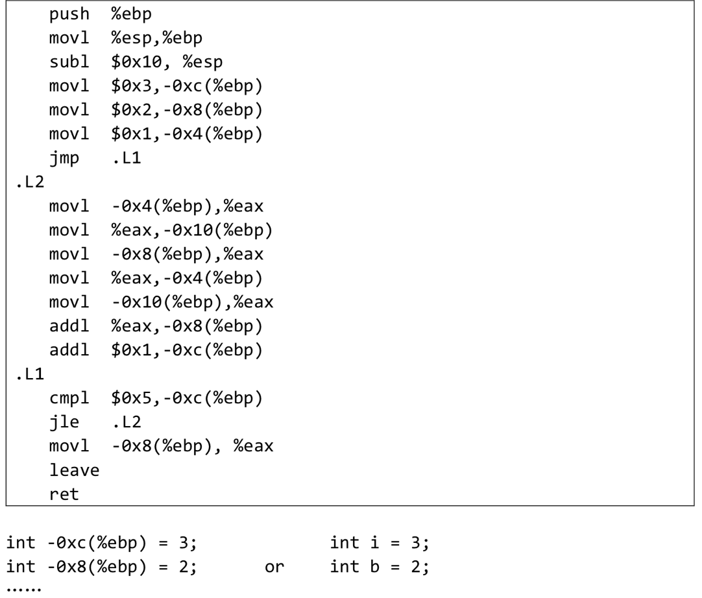

## Homework4

姓名 学号

------------------------------
### Q1(1)
##### Assume we have following address binding table and value of registers : 

| Address | Value | Register | Value| 
|---------|-------|----------|------|
| 0x100   | 0x10  |   %eax   | 0x10 |
| 0x110   | 0x11  |   %ebx   | 0x100|
| 0x120   | 0x12  |          |      |
|    ...  |  ...  |    ...   |  ... |
| 0x190   |  0x19 |          |     |
| 0x200   |  0x20 |          |     |

#### Answer1(1)
##### Please fill in the table below 

|Operand | Value|
|--------|-----|
|%ebx|  |
|$0x150|  |
|0x170|  |
|(%ebx)| |
|(%ebx,%eax)| |
|0x30(%ebx)| |
|80(%ebx,%eax,2)|  |

### Q1(2)
##### Suppose registers and bound values will be reset as above after each instruction. Please fill in the table below: (Write all if there are more than one destinations and None if there is no destination) 

#### Answer1(2)
| Instruction | Destination | Value |
| ----------- | ----------  | ----  |
addl %eax,%ebx |  |  |
subl %eax,(%ebx) |  |  |
leal 0x50(%eax), %edx |   |  |
movzbl %al, %ebx | | |
movsbl %bh, %ecx | |  |

   

### Q1(3)
##### Assume the initial value of the flags is 0. Fill the table below 
#### Answer1(3)
| Instruction | OF | SF | ZF | CF|
| ----------- | -- | -- | ---|---| 
leal(%eax),%ebx| |  |  | |
subl %ebx, %eax|  |  | |  |
xorl %eax, %eax|  |  | | |
test %eax, %ebx|  |  |  | |

### Q2
- Translate the following assembly into C codes.
- You can name local variables represented by -12(%ebp), -8(%ebp)...or a,b,c... freely as you like. 
- The beginning of C codes is given. 
  

#### Answer2
