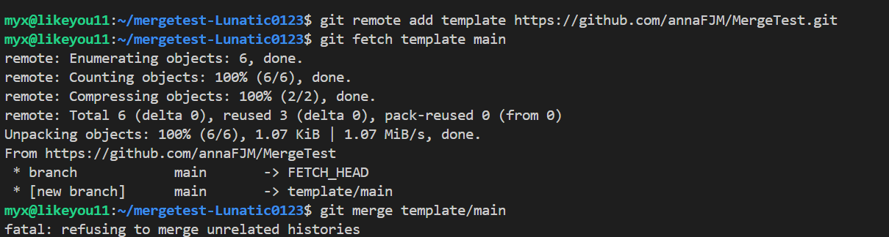
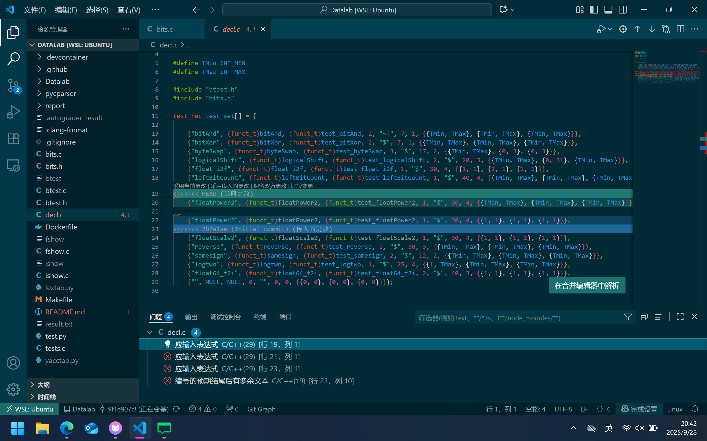
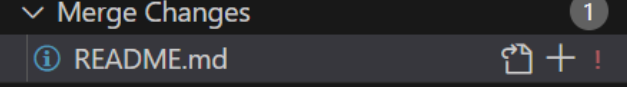

# Git 手动合并修改指南

### 首先进入您的代码仓库目录：
```bash
cd your-repo-path
```

**强烈推荐**：使用 VSCode 打开项目，便于后续查看和解决冲突
```bash
code .
```

### 步骤 1：添加远程仓库
```bash
git remote add template https://github.com/RUCICS/Datalab-2025Fall.git
```
> ⚠️ **注意**：此命令只需执行一次

### 步骤 2：获取远程仓库更新
```bash
git fetch template main
```

### 步骤 3：合并远程仓库更新

您可以选择以下两种合并方式之一：

#### 方式一：使用 merge
```bash
git merge template/main
```

#### 方式二：使用 rebase  
```bash
git rebase template/main
```
如果`git merge template/main`过程出现如下冲突：

你可以换`git rebase template/main`试试
> 💡 **两种方式的区别**：
> - **merge**：保留更多合并细节，显示完整的分支合并历史
> - **rebase**：让提交记录更加整洁，呈现线性历史
> 
> 不同项目通常有不同的偏好，您在第一次 `git pull` 时系统也会询问您的选择。

### 情况一：使用 VSCode 解决冲突

如果您已经运行了 `code .`，可以直接在 VSCode 中解决冲突：

1. **查看冲突文件**
   - 在左侧面板的 `SOURCE CONTROL: CHANGES` 中查看所有冲突文件

2. **解决冲突**
   - 点击打开冲突文件
   - 在冲突区域选择 **Accept Incoming Change**
   
   > 📝 **说明**：以后根据实际情况，您可以选择：
   > - `Accept Current Change` - 接受当前分支的修改
   > - `Accept Incoming Change` - 接受远程分支的修改  
   > - `Accept Both Changes` - 接受双方的修改
   > 
   > 当前建议选择 `Accept Incoming Change`

3. **添加到暂存区**
   - 点击文件右侧的 "+" 号，将修改添加到暂存区

### 情况二：使用命令行编辑器解决冲突

如果没有使用 VSCode，需要通过命令行编辑器（如 vim 或 nano）解决：

#### 步骤 1：理解编辑器界面
执行合并命令后，可能会出现文本编辑器界面。这是因为 merge 操作会自动创建提交，需要您编辑提交信息。

#### 步骤 2：保存并关闭编辑器
根据打开的编辑器类型进行操作：

**如果是 Vim：**
- 按 `Esc` 键退出插入模式
- 输入 `:wq` 保存并退出

**如果是 Nano：**
- 按 `Ctrl + X` 退出
- 按 `Y` 确认保存
- 按 `Enter` 确认文件名
