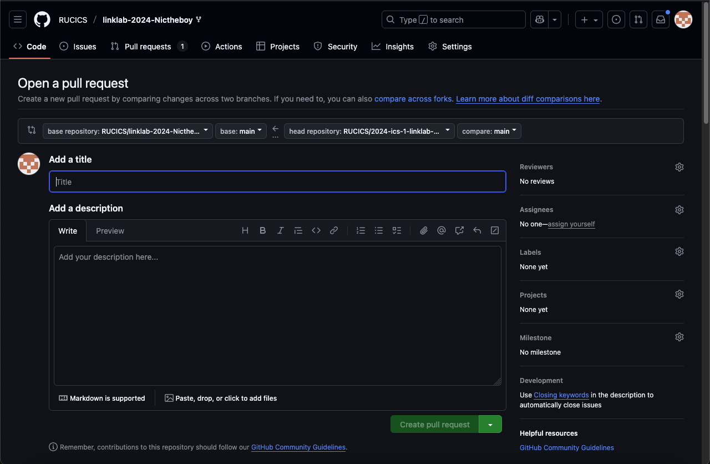

# 如何同步实验的更新？

理想情况下，实验一旦被布置就不需要更新了；但情况总是不太理想。

当助教告诉同学们要更新实验时，请您遵循本文档的操作。

## 目录
- [如何同步实验的更新？](#如何同步实验的更新)
  - [目录](#目录)
  - [步骤一：创建合并请求 (Pull Request，简称 PR)](#步骤一创建合并请求-pull-request简称-pr)
  - [步骤二：同步更新](#步骤二同步更新)
  - [步骤三：确认更新成功](#步骤三确认更新成功)
  - [附录 A：如果您希望挑战自己用命令行完成上述操作](#附录-a如果您希望挑战自己用命令行完成上述操作)

## 步骤一：创建合并请求 (Pull Request，简称 PR)

您在此前肯定通过助教提供的 GitHub Classroom 链接接受了作业，接受作业后您得到了一个**个人仓库**。

我们假设您的**个人仓库**的地址是 `https://github.com/RUCICS/linklab-2024-Nictheboy`，您的仓库名则为 `linklab-2024-Nictheboy`。

在更新实验的通知中，助教会给出一个创建用于合并**助教的修改**到您的**个人仓库**的**链接模版**，例如：

<https://github.com/RUCICS/2024-ics-1-linklab-2024-LinkLab-2024-Assignment/compare/RUCICS:仓库名:main...RUCICS:2024-ics-1-linklab-2024-LinkLab-2024-Assignment:main>

（实际操作时，这个链接应该来自**助教的通知**，而不是这个文档中用作例子的链接）

请您此链接中的“仓库名”替换为您的**个人仓库**的名称，然后访问这个链接：

打开此页面后，请您点击右侧的绿色的`🟩Create Pull Request🟩`按钮，然后跳转到下一个页面：

在下一个页面中，请任意您填写**标题**和**描述**（可选），然后点击绿色的`🟩Create pull request🟩`按钮：

## 步骤二：同步更新

在完成上述操作后，您就成功创建了一个合并请求 (Pull Request，简称 PR)：

在这个 PR 的页面上，请您划动到最底下，理想情况下，您会看到一个绿色的`🟩Merge pull request🟩`按钮：

（如果您看不到这个按钮，说明可能发生了冲突，请您**复制当前页面的链接（URL）**，然后联系助教。）

请您点击这个绿色的`🟩Merge pull request🟩`按钮：

在弹出的框中，您无需做任何修改，直接点击绿色的`🟩Confirm merge🟩`按钮即可。

之后，您会看到刚刚的 PR 页面的左上角已经显示为紫色的`🟪Merged🟪`状态，这说明您更新成功了：

## 步骤三：确认更新成功

为了进一步确认您已经成功更新，您可以回到您的**个人仓库**，刷新浏览器，您会看到您的**个人仓库**已经在非常近的时间内更新了：

## 附录 A：如果您希望挑战自己用命令行完成上述操作

如果您希望挑战自己用命令行完成上述操作，您可以参考这个文档：<https://github.com/RUCICS/cachelab2/issues/5>
