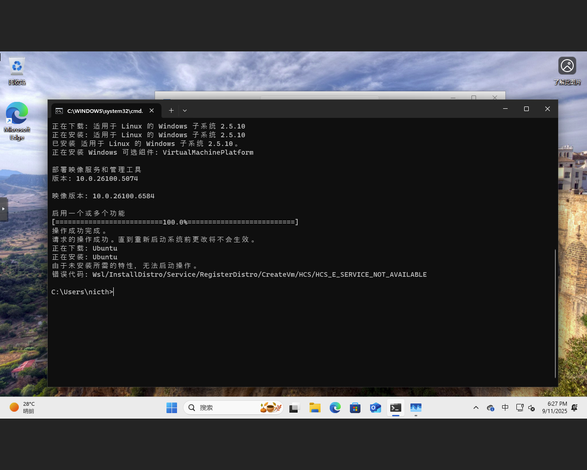
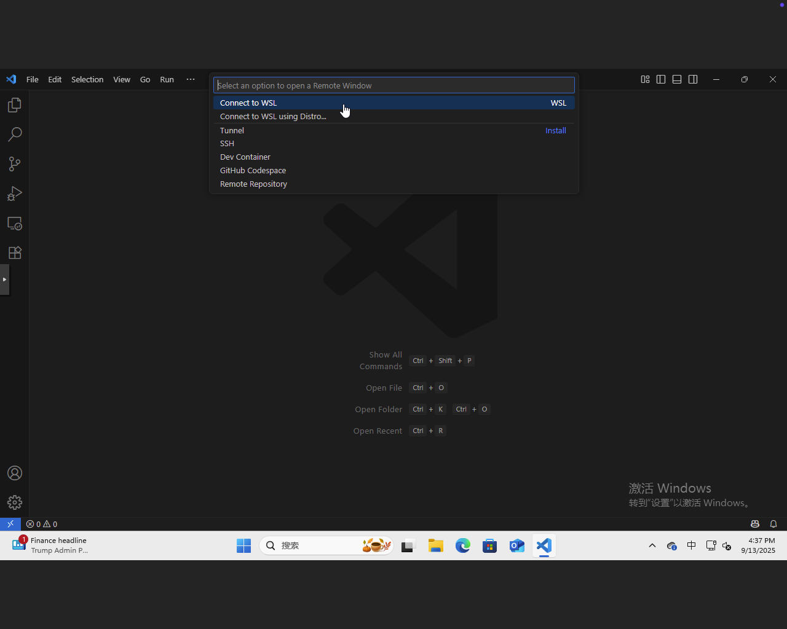
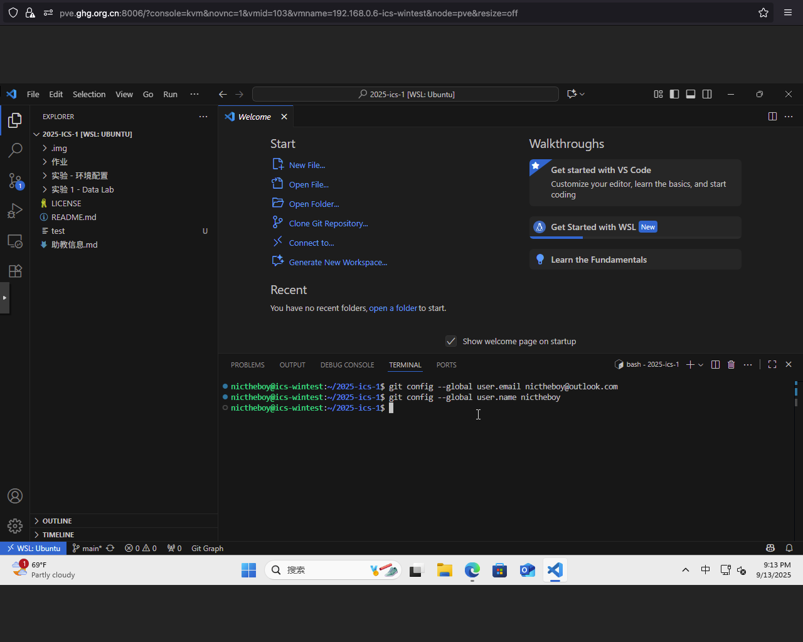
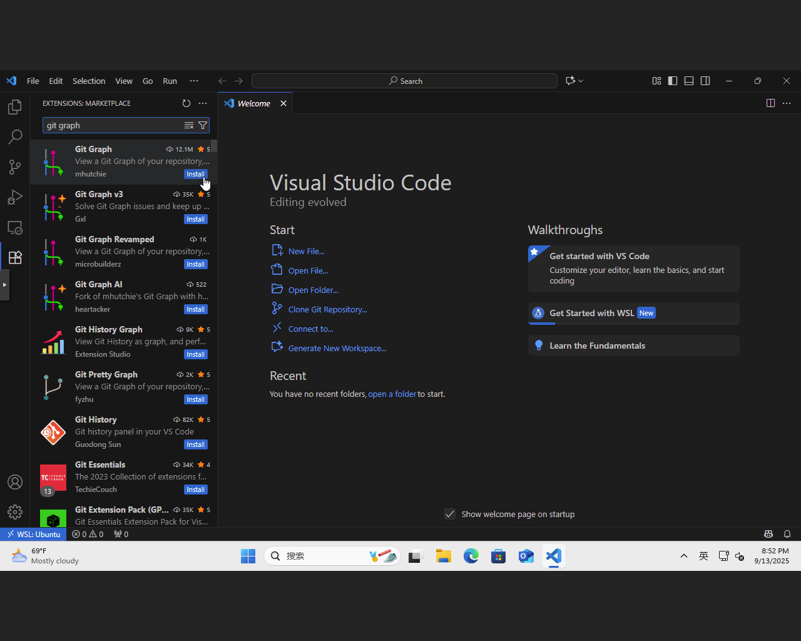

# 实验前 - 环境配置

ICS I 共有 4 个 Lab，分别是 DataLab、BombLab、CacheLab 和 LinkLab。

这些 Lab 都需要在 Linux 环境下完成，因此需要先配置好实验环境。

## 目录
- [实验前 - 环境配置](#实验前---环境配置)
  - [目录](#目录)
  - [1. 安装 WSL](#1-安装-wsl)
    - [1.1. 认识 WSL 和 Linux](#11-认识-wsl-和-linux)
      - [1.1.1. 什么是操作系统？](#111-什么是操作系统)
      - [1.1.2. “开源的类 Unix 操作系统”是什么意思？](#112-开源的类-unix-操作系统是什么意思)
      - [1.1.3. 关于 WSL 和 Linux 环境](#113-关于-wsl-和-linux-环境)
    - [1.2. 最新版 Windows 11 上的 WSL 安装步骤](#12-最新版-windows-11-上的-wsl-安装步骤)
      - [1.2.1. 判断我的电脑是否可以简单地安装 WSL](#121-判断我的电脑是否可以简单地安装-wsl)
      - [1.2.2. 安装 WSL](#122-安装-wsl)
    - [1.3. 旧版 Windows 10 上的 WSL 安装步骤](#13-旧版-windows-10-上的-wsl-安装步骤)
  - [2. 安装 VSCode 并连接 WSL](#2-安装-vscode-并连接-wsl)
    - [2.1. 安装 VSCode](#21-安装-vscode)
    - [2.2. 启用 VSCode 连接的 WSL 功能](#22-启用-vscode-连接的-wsl-功能)
    - [2.3. 连接到 WSL](#23-连接到-wsl)
  - [3. 在 WSL 内安装 Git](#3-在-wsl-内安装-git)
    - [3.1. 认识 Git](#31-认识-git)
    - [3.2. 安装 Git](#32-安装-git)
    - [3.3. 注册 GitHub 账号并创建仓库](#33-注册-github-账号并创建仓库)
    - [3.4. 克隆（Clone）仓库](#34-克隆clone仓库)
    - [3.5. 设置 Git 的用户名和邮箱](#35-设置-git-的用户名和邮箱)
    - [3.6. 尝试提交（Commit）代码](#36-尝试提交commit代码)
    - [3.7. 上传（Push）代码到远程仓库](#37-上传push代码到远程仓库)
    - [3.8. 在 VSCode 中安装 Git Graph 插件并查看 Git 记录](#38-在-vscode-中安装-git-graph-插件并查看-git-记录)
    - [3.9.（可选）进一步学习 Git](#39可选进一步学习-git)
  - [4. 技术支持](#4-技术支持)
  - [5. 总结](#5-总结)


## 1. 安装 WSL

### 1.1. 认识 WSL 和 Linux

Windows Subsystem for Linux (WSL) 是微软提供的一个在 Windows 上运行 Linux 的子系统。

您说，Windows 我知道是什么，但什么是 Linux？Linux 是一种开源的类 Unix 操作系统。您又要说了，
什么是操作系统？什么是开源的类 Unix 操作系统？

#### 1.1.1. 什么是操作系统？

生活中，我们说一个手机是 Android 系统或者 iOS 系统，说一台电脑是 Windows 系统或者 macOS 系统，这些 Android、iOS、Windows、macOS 都是操作系统。

安卓的 Apk 文件不能在 iOS 系统上运行，Windows 的 exe 文件不能在 macOS 上运行，ICS Labs 的程序也只能在 Linux 系统上运行，而不能直接在 Windows 上运行。之所以这样，是因为这些应用程序（Applications）需要操作系统（Operating System）提供的各种服务，而不同的操作系统提供的服务是不一样的。


关于操作系统具体是什么，这是一个很专业的问题。我们这里不深入探讨，只要能理解操作系统是介于硬件和应用程序之间的软件就可以了。

#### 1.1.2. “开源的类 Unix 操作系统”是什么意思？

我们知道，贝尔发明了电话，并创立了贝尔电话公司，贝尔电话公司后来演变为了我们耳熟能详的 AT&T 公司（American Telephone and Telegraph Company）。AT&T 作为最早的电信服务提供商，毫无疑问是计算机最早的商业使用者之一。当时的计算机主流是“批处理”（Batch Processing）系统，用户需要将任务（如穿孔卡片）提交给操作员，然后等待数小时甚至数天才能得到结果，对于 AT&T 这种大公司来说，显然无法接受这种效率。

为了解决该问题，AT&T 先后开发了 CTSS 和 Multics 操作系统，最终 Multics 由于过于复杂而失败了。Ken Thompson 和 Dennis Ritchie 这两位贝尔实验室的研究员按照 Multics 的思路，重新设计了一个更小更简单的操作系统，这就是 Unix 操作系统。

Unix 系统由于其简洁、稳定和强大，在 AT&T 内掀起了一场革命。职员只需要坐在被称为终端（Terminal）的电传打字机（Teletypewriter, TTY）前就可以方便的编辑文件，打错一个字就不得不重新打一整页的时代一去不复返了。工程师们也不再需要通过一个孔也不能打错的纸条来升级 AT&T 的那些复杂的电信控制程序。

但是，根据《1956年最终判决》，AT&T 作为一家电信公司，不能从事计算机业务，因此 Unix 系统被迫开源。Unix 的源代码被许多大学和研究机构使用和修改，衍生出了许多不同的版本（Version），如 BSD、System V 等。


在这种背景下，Andrew S. Tanenbaum 教授为了教学目的，开发了一个与 Unix 兼容但代码完全独立的迷您版 Unix，并将其命名为 Minix（Mini-Unix 的缩写）。Minix 的全部源代码随同他的教科书《操作系统：设计及实现》一同发布。

芬兰的一名21岁的计算机系学生 Linus Torvalds 在学习后对 Minix 的一些设计感到不满，于是在 1991 年，Linux 开始着手开发自己的内核。与此同时，由 Richard Stallman 发起的 GNU 项目也在如火如荼的推进，GNU 项目旨在开发一个完全自由的类 Unix 操作系统，让计算机用户从专业软件昂贵的授权中解放出来。GNU 项目开发了许多操作系统所需的工具和库，但始终缺少一个内核。Linus 和 GNU 项目的成员一拍即合，共同开发了一个完整的类 Unix 操作系统：GNU/Linux 操作系统，简称 Linux。

GNU/Linux 由于其开源、免费、稳定和强大，发展迅速，从一个小众的操作系统，逐渐发展成为服务器主流操作系统。与 Unix 不同，由于 Linux 的内核始终由 Linus 和一些核心开发者维护，Linux 内核并未分叉出多个版本。内核与不同系统软件的结合，形成了各种不同的 Linux 发行版（Distribution），如 Debian、Ubuntu、CentOS、Fedora 等。


#### 1.1.3. 关于 WSL 和 Linux 环境

很长一段时间里，在 Windows 上运行 Linux 只能通过虚拟机（如 VirtualBox、VMware）或者双系统（Dual Boot）来实现。

虚拟机是一种神奇的技术，这种技术通过软件模拟出一台计算机的硬件，并在这台虚拟的计算机上运行操作系统。随着虚拟化技术的发展，虚拟机的性能越来越好，逐渐可以媲美物理机。但使用虚拟机安装 Linux 总归不是很方便，而且 Windows 上最强大的虚拟化软件 VMWare 并不是免费的，而开源的 VirtualBox 的易用性和性能都不如 VMWare。

2016 年，微软发布了 WSL 1，WSL 1 试图让 Windows 内核对这些程序表现的和 Linux 内核一样，但由于二者总有些微妙的差异，这种方式的效果并不好，很多 Linux 程序无法运行。

2019 年，微软发布了 WSL 2，WSL 2 利用 Windows 内置的 Hyper-V 虚拟化技术，在 Windows 上运行一个真正的 Linux 内核，这样就可以完美的运行 Linux 程序了。WSL 2 的性能也非常好，几乎和在物理机上运行 Linux 没有区别。


我们课程中，由于大部分同学使用 Windows 系统，而我们的实验需要在 Linux 环境下完成，综合考虑易用性等因素，我们推荐大家使用 WSL 2 来配置 Linux 环境。但是，这并不意味着 WSL 是唯一的选择，如果您愿意使用传统的虚拟机来运行 Linux，也是可以的。再或者，您也可以使用双系统等方式，直接在物理机上运行 Linux。

对于 MacOS 用户来说，虽然 macOS 本身就是一个类 Unix 操作系统，但因为较新的 Mac 采用 Arm 芯片，而 GDB 等调试工具对 Arm 的支持并不好，所以有些实验可能无法完成。我们推荐 Mac 用户使用虚拟机，或通过下述的远程连接服务器的方式完成任务。

无论您是 Windows 用户还是 Mac 用户，如果想体验纯正的 Linux 环境和多用户环境，您可以通过 SSH 连接到我们提供的 Linux 服务器上完成实验任务。您需要向助教李甘（微信：nictheboy，手机：136 8158 2912 ，邮箱：<ligan@ruc.edu.cn>）申请一个用户。不过由于服务器上会有很多用户同时使用，性能可能会受到影响。但这依旧会是一段不错的体验，您可以体验一下计算机科学的前辈们是如何在公用的计算机上借助多用户操作系统的强大资源共享能力完成任务，不过这也会带来一些不便，需要您逐渐适应。

还有一些类似于上面讲的 WSL 1 的技术，如 Cygwin、MSYS2 等，通过软件方式在 Windows 上模拟 Linux 环境，但和 WSL 1 一样，这些方式并不完美。过去没有人尝试过用这些工具完成 ICS Labs 任务，但如果您愿意尝试，也是可以的。您可以把您的这些奇特的环境配置过程和结果分享到我们的论坛 [http://forum.rucics.tech](http://forum.rucics.tech)，通过这样的过程更好地了解计算机系统。

总之，您需要一个 Linux 环境来完成 ICS Labs 的任务。我们推荐 Windows 用户使用 WSL 2，Mac 用户使用虚拟机或服务器，但只要您愿意折腾而不嫌麻烦，任何方式都是可以的。助教团队愿意随时提供技术支持。

### 1.2. 最新版 Windows 11 上的 WSL 安装步骤

以下的教程都假设您的电脑上从未安装过 WSL。如果您之前安装过 WSL，请直接跳到第 2 节“在 WSL 内安装 Git”。

旧版 Windows 10 上，由于当时的 WSL 2 还是一个试验功能，所以安装较为复杂。而在最新版 Windows 11 上，微软已经将 WSL 2 集成到了系统中，安装非常简单。

#### 1.2.1. 判断我的电脑是否可以简单地安装 WSL

为了判断您是否可以根据本节的教程简单地安装 WSL，您需要执行以下的步骤：

一、按下 `Win + R` 键，打开“运行”对话框，输入 `cmd` 并按下回车键。


二、在打开的命令行窗口中，输入 `wsl --help` 并按下回车键。

如果您看到如下的输出，则说明您的电脑可以简单地安装 WSL，请您继续阅读“1.2. 最新版 Windows 11 上的 WSL 安装步骤”


如果您看到的不是这样的输出，而是提示“'wsl' 不是内部或外部命令，也不是可运行的程序或批处理文件。”，则说明您的电脑不支持简单地安装 WSL，请您跳到“1.3. 旧版 Windows 10 上的 WSL 安装步骤”。

#### 1.2.2. 安装 WSL

**由于安装过程中有一些和直觉不太一样的步骤，所以我们强烈建议您先通读一遍安装步骤，然后再动手安装。**

如果在上一步中，您确认您的电脑可以简单地安装 WSL，那么您只需要在命令行窗口中输入以下命令并按下回车键：

```bash
wsl --install
```

您会看到这样的提示窗口：


请点击“是”以给予安装程序必要的权限。

之后，安装程序会自动为您下载 WSL、安装 WSL。

在此之后，安装程序会为您安装并启用 Windows 的 HyperV 虚拟化平台。我们上面提到过，WSL 2 是通过虚拟化技术来运行 Linux 的。

需要注意，安装过程可能比较漫长，有时程序可能看起来卡死了。但请注意，**您务必不能中途关闭这个窗口**，否则安装会失败，而且**中途退出任何安装程序都可能对您的系统造成不可逆转的损害**。

如果您认为您的安装程序卡死，请您不要关闭这个窗口，而是按下 Ctrl+Shift+Esc 或 Ctrl+Alt+Del 打开任务管理器，看看 CPU 和磁盘的使用率。下面两张截图中，我们可以看到“Windows Module Installer”和“服务主机：Windows更新”的 CPU 使用率相对较高，这说明安装程序并没有卡死，而是在下载和安装必要的组件。


安装完成后，您会看到安装程序报错：



请不用担心，这是正常现象。请您重启电脑。（为什么会这样的呢？如果我们仔细阅读上面的提示，我们会发现，安装程序在安装虚拟化平台时提示，如果不重启，虚拟化平台无法启用，而 WSL 2 需要虚拟化平台才能运行。由于我们刚刚没有重启，所以 WSL 无法顺利安装是必然的。）

在重启后，您会看到 Windows 在更新。正如您看到的，**您不能在这个时候关闭电脑，否则可能会损坏系统**，即使有时候安装程序看起来好像卡死了。


重启后，请您再次按下 `Win + R` 键，打开“运行”对话框，输入 `cmd` 并按下回车键打开 CMD 窗口。

您需要在窗口中输入如下命令，已确定 WSL 是否安装成功：

```bash
wsl --help
```

如果您看到如下复杂的输出，则说明 WSL 平台安装成功了：


接下来，您可以查看一下您的 WSL 平台上有哪些具体的虚拟机：

```bash
wsl --list
```

如果您看到如下的输出，则说明 WSL 平台上目前还没有安装任何 Linux 发行版：


这是正常的，因为之前安装过程中，安装发行版的步骤由于没有重启而失败了。

接下来，您需要安装一个 Linux 发行版。我们推荐使用 Windows 默认的 Ubuntu 发行版以保持您的环境与大多数学生的环境一致。不过毫无疑问，您也可以选择其他的发行版，如 Debian、Fedora 等，但在这些发行版上，您可能会发现我们之后的一些文档无法完全适用。但在这些不同的发行版上配置环境的经历也会让您更好地了解 Linux 系统。

输入以下命令安装默认的 Ubuntu 发行版：

```bash
wsl --install
```


安装过程可能会比较漫长，请耐心等待。和之前一样，**如果您认为安装程序卡死了，请不要关闭窗口，因为终止正在运行的安装程序可能会损坏您的系统。**

在看到如下提示后，说明 Ubuntu 发行版安装成功了，安装程序正在要求您设置您的 WSL 用户名。我们知道，WSL 2 是通过虚拟机实现的，所以相当于一台独立的电脑，现在您看到的正式这台机器首次启动时要求您设置用户名和密码的环节，虽然与 Windows 上不同这里设置用户名密码的环节不是通过图形界面（GUI）而是通过交互式的文本界面实现的。（图中的“nictheboy”是我输入的用户名，在您的电脑上不会自动显示）


请您输入您的用户名，然后按下回车键表示确认。

设置完用户名，系统会提示您设置密码。这里有一个让人迷惑的事情：**您在输入密码时，屏幕上不会显示任何字符**，这是 Linux 系统的一个传统，您只需要正常输入密码，然后按下回车键即可。系统的设计者大概是这么考虑的：即使显示了星号，别人也能通过观察星号的数量来猜测密码的长度，从而降低密码的安全性。

在您设置完密码后，您会发现，您已经进入了 WSL 的 Ubuntu 系统：


恭喜您！您已经成功完成了 WSL 和 Ubuntu 的安装！

### 1.3. 旧版 Windows 10 上的 WSL 安装步骤

**以下的步骤助教团队并没有进行验证，不保证能成功。如果您遇到任何问题，请您在论坛 [http://forum.rucics.tech](http://forum.rucics.tech) 上的“0 WSL Git VSCode 环境配置”板块发帖，我们会尽力提供帮助。**

请您参考微软官方的教程：[旧版 WSL 的手动安装步骤](https://learn.microsoft.com/zh-cn/windows/wsl/install-manual)

## 2. 安装 VSCode 并连接 WSL

### 2.1. 安装 VSCode

考虑到调查问卷显示大部分同学都修过 C 语言相关课程，估计大部分同学应该已经安装好 VSCode 了。

假如您的电脑上没有安装 VSCode 的话，请按照[VS Code C C++环境配置实用手册（修订版第三版）.pdf](./VS%20Code%20C%20C++环境配置实用手册（修订版第三版）.pdf)中“四、下载并安装VS Code”章节的内容，安装 VSCode。**您不需要执行该教程中其余的章节，因为那些内容与 ICS 课程实验无关。**

### 2.2. 启用 VSCode 连接的 WSL 功能

对于新版的 VSCode，启用 WSL 非常简单：

一、单击 VSCode 左下角的“><”符号


二、单击 VSCode 顶侧出现的选择菜单中的“WSL”


三、耐心等待安装完成


等待安装完成后，您就成功安装好 VSCode 的 WSL 插件了。不过这时您好没有连接到 WSL。

### 2.3. 连接到 WSL

一、单击 VSCode 左下角的“><”符号


二、单击 VSCode 顶侧出现的选择菜单中的“Connect to WSL”



三、耐心等待连接完成

由于首次连接时需要在 WSL 内安装必要的组件，所以连接过程可能会比较漫长，请耐心等待。


连接完成后，您就成功连接到 WSL 了。您可以在左下角看到“WSL: Ubuntu“字样，这验证了您已经成功连接到 WSL。


## 3. 在 WSL 内安装 Git

### 3.1. 认识 Git

~~考虑到阅读本教程的大部分同学是初次接触 Git，所以这里只介绍简化版的 Git 概念，缺少许多最重要的内容。严格来说，这里只介绍了完成实验所需的最少的 Git 概念，所以其内容极其片面而不完整。如果希望深入了解 Git，请阅读[Git教程-廖雪峰.pdf](./Git教程-廖雪峰.pdf)~~

Git 是 Linux 内核的作者 Linus Torvalds 为了更好地管理 Linux 内核的开发而开发的一个版本管理工具。

什么是版本管理？版本管理就是管理文件的版本，记录文件的修改历史，方便我们回溯到文件的某个历史版本。

举个例子，您在写一篇论文，您需要记录您论文的每个版本。

如果不使用任何版本管理工具，您可能会这样管理您论文的版本：

1. 毕业论文.docx
2. 毕业论文修改版.docx
3. 毕业论文最终版.docx
4. 毕业论文最终版v2.docx
5. 毕业论文最终版v2_最终版.docx

毫无疑问，这是混乱的。

版本管理工具就是用于解决这种问题的。

以 Git 为例，这种工具将一个文件夹视作一个可变的东西，某个特定时刻的文件夹状态是一个版本，而两个版本之间的“**差异（Diff）**”被称作一次“**提交（Commit）**”。

为了便于多人协作，Git 支持您将代码上传到一个叫“**远程仓库（Remote Repository）**”的地方，这样其他人就可以看到您的代码，并进行协作。同样的，Git 也支持您从远程仓库下载代码。

当然，Git 比我上面讲的要复杂得多，但是对于 ICS 实验来说，知道这些就够了。接下来，我将教会你们在 VSCode 中通过图形化的方式使用 Git。

### 3.2. 安装 Git

Windows 上安装软件往往通过下载安装包的方式完成，但是 Ubuntu（您安装的 WSL 的 Linux 发行版的名字）上不是这样的。

Ubuntu 使用了一种称之为**包管理器**的工具安装软件。每个软件被视作一个**包**，而所有包都被放在一个类似于应用商店的地方——这个地方被称作**软件源（Software Source）**。

Ubuntu 是 Debian 的一个更易于使用的修改版，因此 Ubuntu 使用了和 Debian 一样的包管理器——**APT（Advanced Package Tool）**。

APT 的原理是这样的：APT 会在您的电脑上保存一个包的列表，上面记录了软件源中记录的所有的包的信息，以便于在本地进行搜索。

所以，如果您希望用 APT 安装 Git，您需要做的第一件事是下载这个软件源的列表。您只需要在 WSL 中执行如下命令：

```bash
sudo apt update
```

不过您可能会问：如何在 WSL 中执行命令？方法有很多种，其中最常用的一种是这样的：

一、按照“连接到 WSL”中的方法用 VSCode 连接到 WSL。

二、用如下方法把终端（Terminal）从 VSCode 的底部拽起来：


三、单击被拽起来的终端，使光标（Cursor）出现在终端中。终端中的光标指的是下图中的白色方块：


四、在终端中输入您需要执行的命令，并按下回车键。

您可能希望复制命令并粘贴到终端中。您需要注意：与文本编辑器中不同，终端中的 Ctrl+C 不表示复制，而是表示终止当前程序的命令。那么终端中难道不能复制粘贴吗？当然可以。您需要在终端中使用 Ctrl+Shift+C 和 Ctrl+Shift+V 来复制和粘贴。

例如，如果您希望从本文档复制“sudo apt update”，并粘贴到终端中，您需要先按下 Ctrl+C 复制文本，单击终端以确保光标（那个白色方块）出现在终端内，然后按下 Ctrl+Shift+V 粘贴，最后按下回车表示执行命令。

按下回车后，您会看到如下界面：


这里您需要输入密码，不过像您安装 WSL 时一样，您在输入密码时，屏幕上不会显示任何字符。这是正常现象。

在耐心等待命令执行完成后，如果您看到如下输出，则说明 APT 成功下载了软件列表：


如果您看到的输出中有“E：”开头的报错，则说明出现了某种问题，请您在论坛 [http://forum.rucics.tech](http://forum.rucics.tech) 上的“0 WSL Git VSCode 环境配置”板块寻求助教的帮助。

接下来，您需要命令 APT 下载 Git 并安装。您只需要执行下面的这行命令：

```bash
sudo apt install git
```

按下回车后，您会看到如下界面：


这是正常的，这说明您的 WSL 在此之前已经安装了 Git，您无需做任何操作。

当然，生气的你可能会问，既然 Ubuntu 已经安装 Git 了，我为什么还要执行这个命令？

这主要是因为：

1. ~~助教写这个教程的时候不知道 Ubuntu 已经安装了 Git，但写完之后不舍得删。~~
2. 在之后的实验中，您需要在终端内执行很多命令，学会如何在终端内执行命令是非常重要的。

### 3.3. 注册 GitHub 账号并创建仓库

我们现在已经知道，Git 支持您将代码上传到一个叫“**远程仓库（Remote Repository）**”的地方。GitHub 就是这样一个公共的远程仓库。

GitHub 的网址是 [https://github.com](https://github.com)。如果您打不开这个网址，或网站过于的缓慢，请您联系助教李甘（微信：nictheboy）。

您需要在 GitHub 上注册一个账号。一般来说，这很简单，如果遇到任何问题，请在论坛 [http://forum.rucics.tech](http://forum.rucics.tech) 上的“0 WSL Git VSCode 环境配置”板块寻求助教的帮助。

注册完成后，您需要创建一个**仓库（Repository）**。仓库是一个用于存放代码及其版本信息的文件夹。


### 3.4. 克隆（Clone）仓库

我们假设您已经创建了一个仓库：


请您复制这个仓库的网址，然后点击 VSCode 中的“Clone Repository（克隆仓库）”按钮，粘贴仓库的网址，然后回车确认。


现在 VSCode 在让您选择克隆这个仓库到您 WSL 内的哪个文件夹。由于您的 WSL 内没有什么您创建的文件夹，您只需要使用默认的位置即可。您不需要做任何操作，只需要直接点击蓝色按钮确认：


耐心等待，很快您的仓库就克隆成功了。


如果克隆失败，请您在论坛 [http://forum.rucics.tech](http://forum.rucics.tech) 上的“0 WSL Git VSCode 环境配置”板块寻求助教的帮助。

### 3.5. 设置 Git 的用户名和邮箱

您需要按照“安装 Git”中的方法，拉起终端，并执行如下命令：

```bash
git config --global user.name "您的 GitHub 用户名"
git config --global user.email "您的 GitHub 邮箱"
```

例如，如果您希望设置您的用户名和邮箱为“nictheboy”和“<nictheboy@outlook.com>”，您需要输入如下命令：

```bash
git config --global user.name "nictheboy"
git config --global user.email "nictheboy@outlook.com"
```



如果没有报错，则说明您已经成功设置好了 Git 的用户名和邮箱。

### 3.6. 尝试提交（Commit）代码

为了学习 Git，您可以在您的仓库中创建任意文件并写入一些内容。您必须在新创建的文件内写一些内容，因为 Git 不会区分空文件和不存在的文件。

然后，您需要像下图中一样，写一些提交信息（Commit Message），并点击“Commit”按钮提交代码。


需要注意的是，这里“提交代码”只是指创建了一个版本，但是这个版本到目前为止依然只存在于您的电脑上（称之为“本地仓库”），而您还没有将这个版本上传到远程仓库即您的 GitHub 仓库。

### 3.7. 上传（Push）代码到远程仓库

为了上传到远程仓库，您只需要点一下这个“Sync Changes”按钮：


之后，您需要按照提示登录 GitHub 账号：


如果一切顺利，您回到您的 GitHub 仓库，刷新浏览器，会看到您刚刚提交的代码：


### 3.8. 在 VSCode 中安装 Git Graph 插件并查看 Git 记录

Git Graph 插件是 VSCode 的一个插件，它可以让您在 VSCode 中通过图形化的方式浏览 Git 中存放的文件历史信息（称之为“提交记录（Commit History）”）。

请您安装这一插件：



安装完毕后，您只需要点击下图中的图标，您就可以浏览 Git 的提交记录了。


### 3.9.（可选）进一步学习 Git

这里的指南显然称不上任何意义上的学习 Git 的指南，虽然这里您学到的东西基本上已经够您完成实验了。

如果您有时间和兴趣继续学习 Git，我们强烈推荐您阅读[Git教程-廖雪峰.pdf](./Git教程-廖雪峰.pdf)。

## 4. 技术支持

如果您遇到任何问题，您可以尝试阅读[WSL 安装自助排查文档.md](./WSL%20安装自助排查文档.md)和[Git 安装自助排查文档.md](./Git%20安装自助排查文档.md)。

如果这两个文档没有记载您的问题，请您在论坛 [http://forum.rucics.tech](http://forum.rucics.tech) 上的“0 WSL Git VSCode 环境配置”板块寻求助教的帮助。

## 5. 总结

您或许要说：配置环境真是烦人！讨厌！我还什么也没有写，就浪费了这么多时间。

您说的很对，配置环境确实烦人、无趣而鲜有知识收获。

可是世界上真正有趣的事情又有多少呢？大多是不得不做的无聊之事罢了。Life is such, and such is life.
